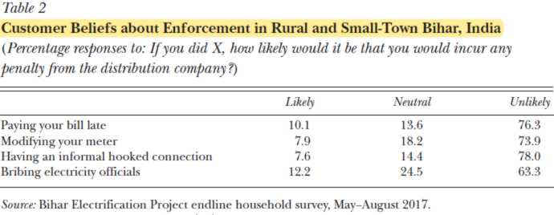
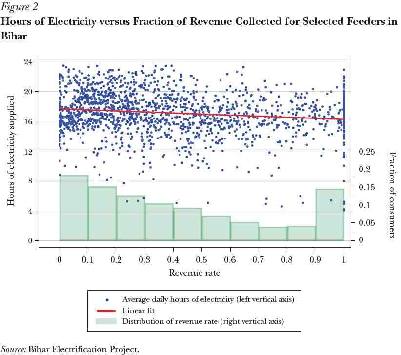

The story in many developing countries is not dissimilar. Power theft, bill nonpayment, bribery, and corruption of utility employees is more widespread than us 24/7 electricity-receiving folks would know about. For some context, a [UAE aid project to Pakistan](https://reliefweb.int/report/pakistan/uae-pap-implements-humanitarian-projects-cost-us-320-million) to help rebuild 2 flood-wrecked bridges, many asphalt roads, as well as 60 projects including schools in remote areas ***cost USD 320m.*** 

---

## Executive Summary

This post will show how typical methods to help people can backfire, if policymakers do not understand how the policy works on the ground. We are inspired by a recent open-access paper published this year in the American Economic Association: [*The Consequences of Treating Electricity as a Right*, by Burgess et al.](https://www.jstor.org/stable/10.2307/26873533) In many developing countries, nearly a billion people are not connected to the power grid, or receive intermittent electricity. The paper's authors argue that this problem is caused by the prevailing social norm that electricity is a basic right rather than a typical economic private good. 

In short, giving electricity this status creates many problems for power utilities: 

* **Bill non-payment and electricity theft is tolerated** (socio-political effect), which makes power distribution a loss-making business. 
* Government policies try to **stem the symptoms by offering subsidies** to utilities to cover their losses. However, subsidy disbursements are often delayed. They are also not sufficient since they only subsidize what has been consumed, not power that was stolen or lost in the system.

Overall, power utilities realise the only way to barely break even is **for them to ration electricity**. This means that consumers who wish to use electricity (and are willing to pay for it) cannot get access to 24-hour electricity, creating a clear and avoidable loss of social welfare.  

## Electricity as an Economic Good

Electricity is unlike other basic necessities which are usually either **<u>excludable</u>** (meaning one can be cheaply excluded from consuming if they do not pay for it) or **<u>have many private substitutes</u>**. For example:

- Water is sometimes non-excludable since it is easy to tap ([Thames Water loses up to 3m litres](https://www.ft.com/content/e8cc9670-00f4-11e8-9650-9c0ad2d7c5b5) of water per year due to theft), but it is possible to [buy water tankers](https://www.deccanherald.com/metrolife/peak-season-tanker-business-720834.html) as a private individual at only a slight premium to cover any personal shortage.
- Fire control is non-excludable (by policy, firefighters help everyone without them paying for it directly). However, there are [private firefighters available for rich celebrities](https://www.nytimes.com/2019/10/26/style/private-firefighters-california.html) in California.
- A cliché example in economics is the market for cable TV, which is usually excludable (producers can scramble the signal and charge for the unscrambling set-top box). 

Non-excludable goods usually have non-intuitive markets. The market for movies is easy to estimate if we look at movie theatres, but difficult if we look at movie piracy. Who pays? Does that money incentivise others to produce? For the examples listed above, if Thames Water were losing a huge share of its revenue due to stolen water, it might not break even as a business and thus stop supplying water. This means that people who need the water will be left thirsty (read: "loss of social benefit" in economics jargon). Fortunately, water tankers are cheaply available for those whose water needs are not met fully. 

Electricity, likewise, can be non-excludable (especially in developing areas where overhead cables are a mainstay and easily tapped), and the private alternatives such as diesel generators or solar, are still prohibitively expensive compared to how much grid power costs. Estimates in a developed nation ([PDF link](https://www.lazard.com/media/450337/lazard-levelized-cost-of-energy-version-110.pdf)) like the US range from a Levelised Cost (including and averaging all input costs) of $0.197 per KWh for diesel generators vs just $0.042 for Gas Combined Cycle plants. The former is even further costly if run as a smaller unit like a household) and the latter is typically used in grid-scale power.

## The Social Norm surrounding Electricity

The social norm propagates because electricity, like water, shelter, and food, is seen as a basic necessity in many developing nations. This makes it seem unethical/wrong to penalise people for the non-payment or theft of electricity, which makes them almost *unpunishable*. Figure 2 below shows how 78% of people thought stealing electricity was unlikely to be penalised. This supports the existence of the norm and its effects.

Another part of the social norm dictates that governments should support their citizens in attaining cheap electricity. Governments are, however, usually stuck between this norm and the economic reality that no one runs a loss-making utility.  Many governments turn to subsidies to solve this problem; to help utilities to barely break even. This method means using limited taxpayer money to subsidize those who would otherwise be able and liable to pay for the electricity they do not pay for.

## So why is this norm a bad thing again..?

There are a few concrete reasons how this norm ultimately leads to intermittent power supplies and still wastes precious fiscal reserves. 

1. Government subsidies, by definition, have to only apply on the electricity that is sold. In the power utility industry, theft counts under "Transmission and Distribution Losses" (T&D), which means this energy was *never sold*. So the government does not fully subsidize the utility for the energy it provides.
2. Subsidies do not reach utilities on time (bureaucratic red-tape).
3. Due to the social norm, it is difficult to switch off someone's electricity if they do not pay (and if a utility still does, there is a chance that electricity will just be stolen), and so revenue collection is a nightmare for utilities.
4. All the above reasons were focused on variable costs (literally fuel cost and routine maintenance), but utilities have to maintain the grid and have further fixed costs like generation, transmission, and power meter equipment. These costs further tip the cost-benefit balance for utilities.
5. With such a balance, utilities are *incentivised to not improve electricity access*. Every new connected customer is likely to be just another bill evader or will informally hook to the grid.

With utilities not being paid for their product by consumers and inadequately by the government, they have no choice but to ration supply to reduce their losses. This means a truly unique market where producers would rather lose customers and produce lesser to inch closer to breaking even. The government loses out because it spends money on ensuring stable electricity but it does not achieve that either.

## Conclusion: Proposed Solutions

All of the paper's proposed solutions centre on changing the belief and getting people to pay their fair share for their use.

Firstly, revamp the subsidy system. The wide-ranging, undifferentiated subsidies support this social norm, since everyone across the income distribution enjoys them. Its subliminal message is that electricity is a right for everyone and thus the government subsidises it. *"Therefore if I steal it, I am following what the government wants to achieve"*. **To fix this,** provide direct benefits to the poor in society, i.e. let the government do the work of "consumer differentiation" that the utilities cannot. 

Secondly, reduce power theft. We can use Behavioural Economic techniques like establishing a clear consequence, since ["We'll happily cheat... until it hurts"](https://business.time.com/2012/06/18/why-almost-all-of-us-cheat-and-steal/). This can be done by explicitly linking hours of electricity received in a month to bill payment rates in the previous month, and telling people it is because the utility cannot break even. We can communicate the benefits of paying for one's electricity usage (like the "[tap out on your stop](https://www.facebook.com/30009150928/photos/a.10150674877980929/10155126558495929/?type=3&theater)" posters on Singaporean buses). Another source of theft is due to corrupt utility employees who collect payments but turn a blind eye to meter tampering if they are bribed. This can be solved by changing their salary to become commission-based. Finally, another way is to have micro-grids operated by members of the community so that any theft is felt (and discouraged) within the society.

One way that will not help is **Privatisation**. Any private entity that steps in will fail quickly due to the social norm, and society will suffer as a result. This may only work if other methods are used to break the social norm as well.

## Appendix 1: theditor's thoughts

When we read this paper, many questions jumped out in our face. Here are some of the tangents that we thought of.

- What are the political and ethical issues caused by withholding/forcing people to pay for energy? Are they balanced out by the alternative of intermittent energy today?
- If setting such a social norm (of having a 'right' to such basic necessities) is detrimental to the consumers themselves, what does it mean for Universal Basic Income or Minimum Wage? Or are these just very different?
- Catch-22: Poor people cannot pay for power, but cannot rise above poverty[^1] because they only have intermittent electricity. So how do we fix this problem?
- Is it worth to subsidise the entire shortfall and use taxpayer money to fund it?
- Should a government "tank"/ weather through a period of lossmaking while they get access to everyone? (Higher access initially means more theft and nonpayment, until laws and norms catch up)
- o  In 2015, Delhi introduced a 50% subsidy for households using <400 KWh of power per month. In 2019, <200 KWh-using households were exempted from bills. What does this do to the social norm? Is it worth doing to help people?
- What does this free-rider problem mean for online piracy? Is that market different?
- Is means-testing for electricity subsidies worth the ostracisation of poor people? 

[^1]: For example, operating irrigation systems requires electricity, and farmers have a high WTP (ie. how much one would be willing and able to pay for a service), but are strictly limited by the amount of electricity available to them. In a Catch-22 situation, [water-efficient drip-irrigation methods required 8 hours of continuous electricity](https://www.downtoearth.org.in/news/agriculture/lighting-up-the-fields-how-electricity-can-help-irrigation-69571), which is rarely continuous and unpredictable to boot.

## Appendix 2: Evidence from Bihar 

Every main grid is divided into feeders, each serving about 2500 households and businesses. Revenue rate is calculated as the ratio of actual revenue collection to expected collection: reflecting T&D Losses as well as unbilled and unpaid bills. The green bars show the density of the blue dots above them: a taller bar means more households concentrated in that revenue rate bin. 

The graph shows that there is no link between hours of electricity provided and the amount of revenue collected. Normally, if we get a higher quality good, it is because we pay more for it, making this arrangement very counter-intuitive and unique. 

Data from the World Bank shows that T&D Losses are 4 times higher in low-income countries that high-income (22.8% vs 6.1%). This is with roughly the same efficiency of transmission equipment used. Thus, it must be caused by societal or institutional factors like bill evasion or theft. Moreover, the cost of producing energy is roughly the same in both types of countries (0.064 vs 0.062 USD/KWh). But, utilities in the former countries earn only $0.46 per $1 they spend on producing and distributing power, compared to $3 per $1 in developed nations. 

